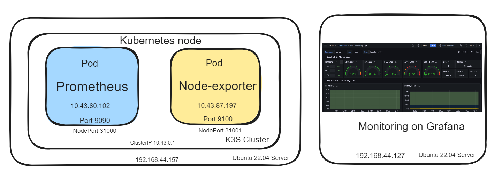

# Kubernetes Monitoring: Deploying Prometheus and Grafana on K3s

This repository provides instructions and resources for setting up Kubernetes monitoring using Prometheus and Grafana on K3s.

For detailed instructions, please refer to the blog post: [Kubernetes Monitoring: Deploying Prometheus and Grafana on K3s] (https://autonetmate.com/nms/kubernetes-monitoring-deploying-prometheus-and-grafana-on-k3s/)